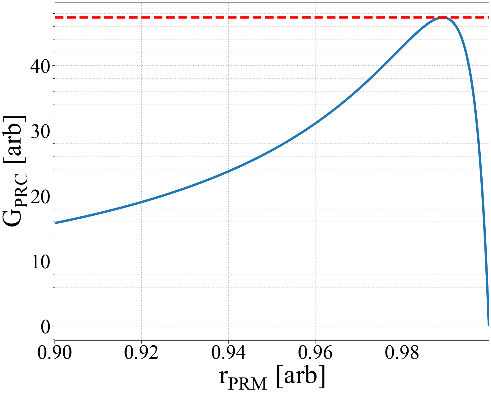
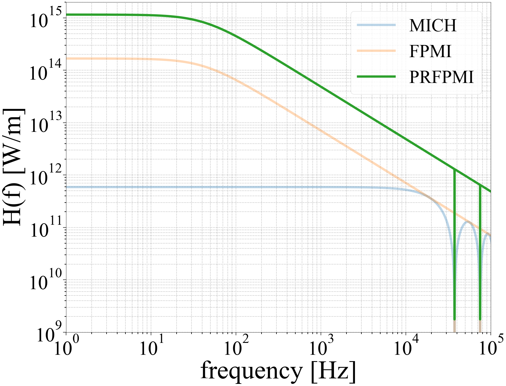
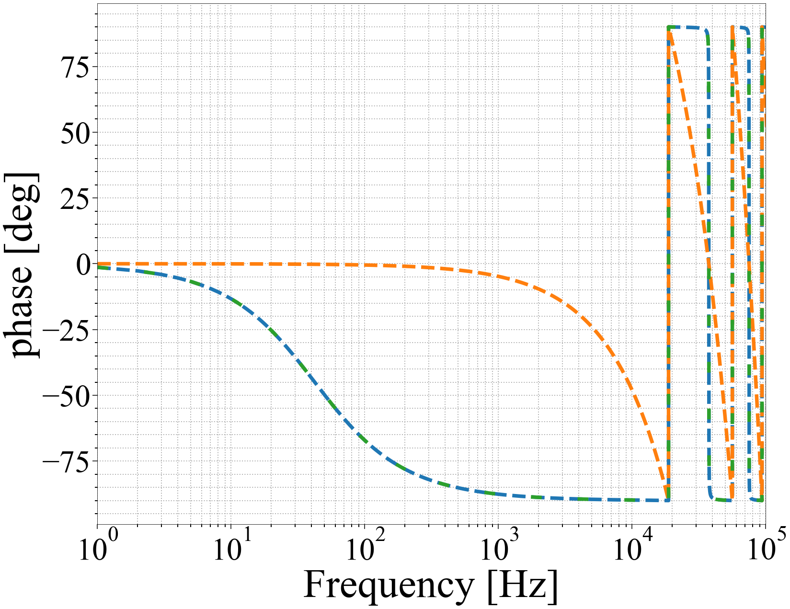
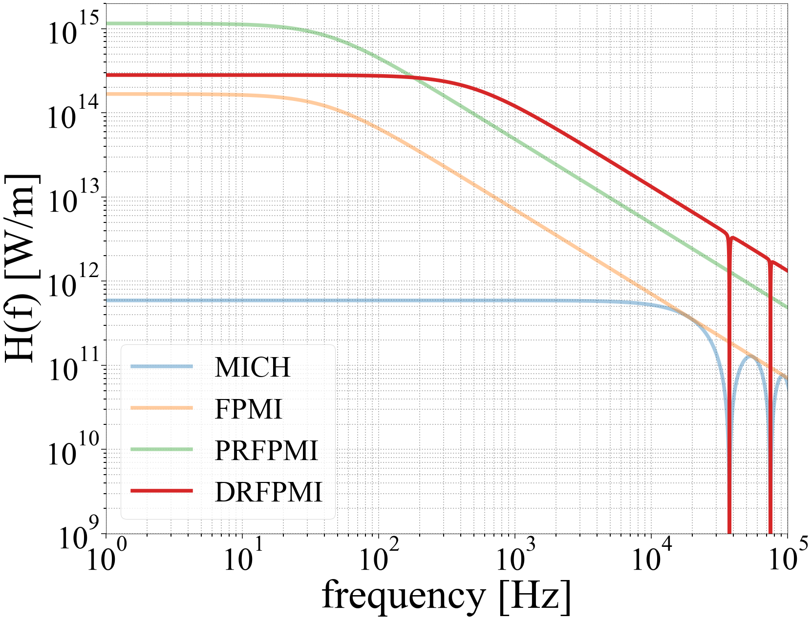
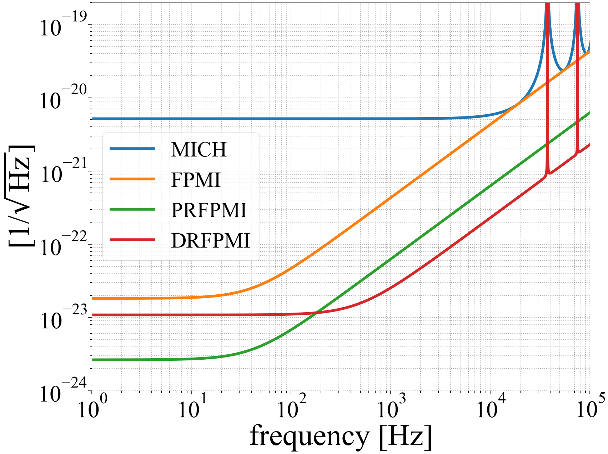

```python
import numpy as np 
import matplotlib.pyplot as plt
import scipy.signal as sig
import os 
import sys
sys.path.insert(0,'../')
plt_style_dir = '../../stash/'
fig_exp_dir = '../../../figs/'
import ifo_configs as ifco
if os.path.isdir(plt_style_dir) == True:
    plt.style.use(plt_style_dir + 'ppt2latexsubfig.mplstyle')
plt.rcParams["font.family"] = "serif"
plt.rcParams["font.serif"] = ["Times New Roman"] + plt.rcParams["font.serif"]
line_width=7.5
```
Up to this point we can understand how the FPMI repsonse function works:
$$ H_{FPMI}(\omega_g) = \frac{2 \Delta \phi_r(\omega_g)}{h(\omega_g)} =  \frac{t_1^2r_2}{(t_1^2 + r_1^2)r_2 -r_1} \frac{H_{\mathrm{MI}}(\omega_g, L)}{1-r_1r_2e^{-2i \omega_g L /c }}  $$

```python
# Some parameters
cee = np.float64(299792458)
OMEG = np.float64(2*np.pi*cee/(1064.0*1e-9))
L = np.float64(4000.0)
nu = np.arange(1, 1000000, 1)
nat_nu = [np.float64(i*2*np.pi) for i in nu]
h_0 = np.float64(1)

T_1 = .014
#T_1 = 25e-6 
T_2 = 50e-6
R_1 = 1-T_1
R_2 = 1-T_2

t_1 = T_1**.5
r_1 = R_1**.5
r_2 = R_2**.5 

PHI_0 = np.pi/2 
P_IN = 25
```
# POWER RECYCLING## Derivation
With all the power going to the symmetric port, the nominal operating state of the FPMI involves a significant amount of dumped / wasted power. Placing a mirror at the symmetric port can allow that power to be recycled. Though considerations must be made to maximize the amount of recycling gain you can acquire with your GW detector. This is dependent on the placement of the power recycling mirror (PRM) and its  reflectivity, transmission, and loss coefficients. 

But first, the field at the symmetric port:

$$E_\mathrm{SYM} = \frac{E_i}{2}e^{2ikl}(r_\mathrm{FP,X} + r_\mathrm{FP,Y}) $$

This is realized through observing the circulating power between the PRM and the short Michelson:

$$ E_\mathrm{PRC} = \frac{t_\mathrm{PRM}}{1- r_\mathrm{PRM} r_\mathrm{FPMI} e^{2ik (L_\mathrm{PRC2BS} + L_\mathrm{SMICH})}}E_\mathrm{in} $$ 

Where:

$$ L_\mathrm{SMICH} = l_x + l_y $$ 

Now let's observe the cavity reflection parameter:

$$ r_\mathrm{FP} = -r_1 + \frac{t_1^2 r_2 e^{i2kL}}{1-r_1 r_2 e^{i2kL}} = -\frac{\mathcal{F}}{\pi} \Big[-\Big(\frac{r_1}{r_2} \Big)^{1/2} + \Big(\frac{r_2}{r_1}\Big)^{1/2} (r_1^2 + t_1^2) \Big]$$
But with loss considerations:

$$ r_\mathrm{FP} = -r_1 + \frac{t_1^2 r_2 e^{- t_\mathrm{RT}/\tau_\mathrm{loss}}  e^{i2kL}}{1-r_1 r_2 e^{- t_\mathrm{RT}/\tau_\mathrm{loss}} e^{i2kL}} \approx -\frac{\mathcal{F}}{\pi} \Big[\frac{-r_1 +  r_2(r_1^2 + t_1^2)(1-\mathscr{L}_\mathrm{RT})}{\sqrt{r_1 r_2}} \Big]$$
we know that $t_1^2 << r_1^2$: 

$$r_\mathrm{FP} \approx -\frac{\mathcal{F}}{\pi} \Big[ \frac{r_1(-1 + (1 - \pi/\mathcal{F}) (1- \mathscr{L}_\mathrm{RT}))}{\sqrt{r_1 r_2}} \Big] \approx  -\Big(\frac{r_1}{r_2}\Big)^{1/2} \frac{\mathcal{F}}{\pi} \Big[- \pi/\mathcal{F} - \mathscr{L}_\mathrm{RT} + (\mathscr{L}_\mathrm{RT}\pi)/\mathcal{F}) \Big] $$And $\mathscr{L}_\mathrm{RT} <<1$ with $r_1 /r_2 \approx 1$ we get:

$$r_\mathrm{FP} \approx -1 + \frac{\mathcal{F}}{\pi} \mathscr{L}_\mathrm{RT}$$If we're operating at a dark fringe, at the symmetric port we see superimposed fields:

$$ E_\mathrm{SYM}  = \frac{E_i}{2} \Big[ r_\mathrm{FPX}e^{2ik\mathscr{l}_x} + r_\mathrm{FPY}e^{2ik\mathscr{l}_y} \Big] $$

Where we assume that the short Michelson arms and reflection coefficients are roughly equal ($\mathscr{l}_x = \mathscr{l}_y$, $r_\mathrm{FPX} = r_\mathrm{FPY}$)

We also can average the short Michelson arm lengths $(\mathscr{l}_x + \mathscr{l}_y)/2$ such that the effective reflection coefficient is:
$r_\mathrm{FPMI} = e^{2ik\mathscr{l}}(- 1 + \frac{\mathcal{F}}{\pi} \mathscr{L}_\mathrm{RT})$Knowing this we create the following expression for the circulating power within the cavity:

$$ P_\mathrm{PRC} = \frac{|t_\mathrm{PRM}|^2}{|1-r_\mathrm{PRM} r_\mathrm{FPMI} e^{2ik(L_\mathrm{PRC2BS} + L_\mathrm{SMICH})}|^2} P_\mathrm{in}$$where $|t_\mathrm{PRM}|^2 = 1 - |r_\mathrm{PRM}|^2 $ and given a carrier resonance condition we want to maximize the power with a variable PRM reflectivity:

$$\frac{\partial P_\mathrm{PRC}}{\partial r_\mathrm{PRM}} = \frac{2r_\mathrm{PRM}^2(r_\mathrm{FPMI} - r_\mathrm{PRM})}{(1 - r_\mathrm{PRM} r_\mathrm{FPMI})^3} = 0$$

which sets $ r_\mathrm{PRM} = r_\mathrm{FPMI} $ On resonance, the power recyling gain ($G_\mathrm{PR} = \frac{P_\mathrm{PRC}}{P_\mathrm{in}}$):

$$ G_\mathrm{PR} = \frac{\pi}{2 \mathcal{F} \mathscr{L}_\mathrm{RT}} \Bigg[ \frac{1}{1- \frac{\mathcal{F}\mathscr{L}_\mathrm{RT}}{2 \pi}} \Bigg] $$

```python
r_FPMI = -r_1 + (T_1*r_2)/(1-r_1*r_2)
T_PRM = .03
R_PRM = 1-T_PRM
t_PRM = (T_PRM)**.5
r_PRM = (R_PRM)**.5
G_PRC = 1/(1-r_PRM*(r_FPMI))
```


```python
L_rt = 75e-6
Finn = (np.pi*np.sqrt(r_1*r_2))/(1-r_1*r_2)
print(Finn)
```

    444.0741558169753


```python
r_FPMI_approx = (1 - Finn*L_rt/np.pi)
```


```python
r_range = np.arange(.9,1,1/(2**16))
```


```python
G_PRC_ = ifco.PRG(L_rt, Finn, r_range, max=0) 
```


```python
G_PRC_opt =  ifco.PRG(L_rt, Finn, r_FPMI, max=1)
```


```python
plt.plot(r_range, G_PRC_, linewidth=line_width)
plt.axhline(G_PRC_opt, linestyle='--',linewidth=line_width, color='r')
plt.xlim(r_range[0], r_range[-1])
plt.xlabel('$\mathdefault{r_{PRM}}$ [arb]')
plt.ylabel('$\mathdefault{G_{PRC}}$ [arb]')
```


    Text(0, 0.5, '$\\mathdefault{G_{PRC}}$ [arb]')


    

    


```python
G_PRC_actual = ifco.PRG(L_rt, Finn, r_PRM, max=1)
```


```python
H_FPMI = ifco.fpmi_freq_resp(nu, r_1, t_1, r_2, L, PHI_0, P_IN, OMEG)
H_FPMI_LP = ifco.fpmi_freq_resp(nu, r_1, t_1, r_2, L, PHI_0, P_IN, OMEG, low_pass='True')
```


```python
H_PRFPMI = ((G_PRC_actual)**.5)*H_FPMI
```
We estimate the FP's pole frequency
$$  1 - r_1 r_2 e^{-2i \omega_g L / c} = 0 $$
therefore when:
$$ e^{-i \omega_g L / c} = \frac{1}{\sqrt{r_1 r_2}} $$
we acquire the pole frequency $\omega_\mathrm{pole}$ as indicated in the low pass
$$ f_\mathrm{pole} = \frac{1}{4\pi \tau_{s}} =  \frac{c}{4 \pi L} \frac{1- r_1 r_2}{\sqrt{r_1 r_2}} = \frac{\nu_\mathrm{FSR}}{2 \pi} \frac{1- r_1 r_2}{\sqrt{r_1 r_2}} = \frac{\nu_\mathrm{FSR}}{\mathcal{F}} $$Might as well compare it to our Michelson response: 
$$ H_{\mathrm{MI}}(\omega_g) = \frac{2 L \Omega}{c}e^{-i L \omega / c} \frac{\mathrm{sin}(L \omega /c)}{L \omega /c} $$

```python
H_MI = ifco.mich_freq_resp(nu, L, PHI_0, P_IN, OMEG)
```


```python
plt.loglog(nu, ifco.bode_amp(H_MI), label= 'MICH', linewidth= line_width, alpha=.3)
plt.loglog(nu, ifco.bode_amp(H_FPMI), label='FPMI', linewidth=line_width, alpha=.3)
plt.loglog(nu, ifco.bode_amp(H_PRFPMI), label='PRFPMI', linewidth = line_width)
#plt.axvline (x=f_pole,ymin=1e-11, color='red', linestyle='dotted', linewidth=3)
plt.xlim([1e0, 1e5])
plt.ylim([1e9,2e15])
plt.xlabel('frequency [Hz]')
plt.ylabel('H(f) [$\mathdefault{W/m}$]')
lgd=plt.legend()
plt.savefig('../figs/INTRO/prfpmi_fr.pdf', dpi=300, bbox_inches='tight')
```


    

    


```python
plt.semilogx(nu,(180/np.pi)*np.arctan(np.imag(H_FPMI)/np.real(H_FPMI)),'--', linewidth=line_width)
plt.semilogx(nu,(180/np.pi)*np.arctan(np.imag(H_MI)/np.real(H_MI)), '--', linewidth=line_width)
plt.semilogx(nu,(180/np.pi)*np.arctan(np.imag(H_PRFPMI)/np.real(H_PRFPMI)),linestyle='--', linewidth=line_width,dashes=(3,10))
plt.xlim([1,100000])
plt.ylabel('phase [deg]')
plt.xlabel('Frequency [Hz]')
```


    Text(0.5, 0, 'Frequency [Hz]')


    

    

# SIGNAL RECYCLINGInitially not used in early iterations of LIGO (intial LIGO and enhanced LIGO) signal recycling imagines using a partially reflective mirror at the anti-symmetric port. And at first glance it seems to not very much make sense to have a mirror at detector output as you would potentially attenuate gravitational wave signals by said mirror reflection coefficient. 

While true, it is important to analyze the multi-state configurations offered by such a mirror with various microscopic length tuning configurations. What do I mean by this? Well, it helps to start imagining by analogy of couple cavity relationship as established in the power recycling discussion. The relationship of the differential signal output of the PRFPMI with respect to the newly placed mirror at the anti-symmetric port is represented by the following:


$$ t_\mathrm{SRC} = \frac{t_\mathrm{ITM}t_\mathrm{SRM} e^{i  (k + \Omega/c) \mathscr{l}_\mathrm{SRC}}}{1- r_\mathrm{ITM}r_\mathrm{SRM} e^{2i  (k + \Omega/c) \mathscr{l}_\mathrm{SRC}}}$$

$$ r_\mathrm{SRC} = \frac{r_\mathrm{ITM} - r_\mathrm{SRM} e^{2i  (k + \Omega/c) l_\mathrm{SRC}}}{1- r_\mathrm{ITM}r_\mathrm{SRM} e^{2i  (k + \Omega/c) \mathscr{l}_\mathrm{SRC}}}$$

as $k >> \Omega_\mathrm{gw}/c$ for $ 1 < \Omega_\mathrm{gw} < 5 \cdot 10^3 $

Therefore with a pre-defined $T_\mathrm{ITM} + R_\mathrm{ITM} + L_\mathrm{ITM} = 1$ the coupled cavity pole AND gain is a function of the SRM reflectivity and microscopic length tuning:

$$ t_\mathrm{SRC} = \frac{t_\mathrm{ITM}t_\mathrm{SRM} e^{i k \mathscr{l}_\mathrm{SRC}}}{1- r_\mathrm{ITM}r_\mathrm{SRM} e^{2i k \mathscr{l}_\mathrm{SRC}}}$$

$$ r_\mathrm{SRC} = \frac{r_\mathrm{ITM} - r_\mathrm{SRM} e^{2i k l_\mathrm{SRC}}}{1- r_\mathrm{ITM}r_\mathrm{SRM} e^{2i k \mathscr{l}_\mathrm{SRC}}}$$We now observe the tuning extrema:
- On resonance $2ik \mathscr{l}_\mathrm{SRC} = 2i\phi_\mathrm{SRC} = 0$:
    $$ r_\mathrm{SRC \; , \; \phi_{SRC} = 0} = \frac{r_\mathrm{ITM} - r_\mathrm{SRM}}{1- r_\mathrm{ITM}r_\mathrm{SRM}}$$
- On resonance $2ik \mathscr{l}_\mathrm{SRC} = 2i\phi_\mathrm{SRC} = \frac{\pi}{2} $:
$$ r_\mathrm{SRC \; , \; \phi_{SRC} = \pi} = \frac{r_\mathrm{ITM} + r_\mathrm{SRM}}{1+ r_\mathrm{ITM}r_\mathrm{SRM}}$$$$\mathrm{H}_\mathrm{DRFPMI} = \mathrm{G}_\mathrm{PR} \mathrm{P}_\mathrm{in} L \Omega \bigg[ \frac{ t_\mathrm{ITM}^2 r_\mathrm{ETM}}{(t_\mathrm{ITM}^2 + r_\mathrm{ITM}^2)r_\mathrm{ETM} - r_\mathrm{ITM}} \frac{t_\mathrm{SRM} t_\mathrm{ITM} e^{i\phi_\mathrm{SRC}}}{1-r_\mathrm{ITM} r_\mathrm{SRM} e^{i2\phi_\mathrm{SRC}}} \frac{e^{-i 2 \pi L f / c} \mathrm{sin}( 2 \pi f / c)}{ 2 \pi L f } \frac{\mathrm{sin}(\phi_0)}{1- [(r_\mathrm{ITM} - r_\mathrm{SRM} e^{i2\phi_\mathrm{SRC}})/(1-r_\mathrm{ITM} r_\mathrm{SRM} e^{i2\phi_\mathrm{SRC}})] r_\mathrm{ETM} e^{-i 4 \pi L f / c}} \bigg]$$

```python
l_SRC = 56  #[m]

T_SRM = .30
R_SRM = 1-T_SRM
t_SRM = T_SRM**.5
r_SRM = R_SRM**.5

phi_SRC = np.pi
```


```python
H_DRFPMI = ifco.drfpmi_freq_resp(nu, G_PRC_opt, r_1, t_1, r_2, r_SRM, t_SRM, phi_SRC, L, PHI_0, P_IN, OMEG)
```


```python
bode_test=False
if bode_test:
    fig, ax1 = plt.subplots()
    ax1.set_xlabel('frequency [Hz]')
    ax1.set_ylabel('H$_\mathdefault{FPMI}$  [$\mathdefault{W/m}$]  ', color='C0')
    #ax1.plot(w/(FSR), F_w_cc_modsq*100)
    ax1.loglog(nu, ifco.bode_amp(H_FPMI), label='FPMI', linewidth=line_width, linestyle=':',color='C0')
    ax1.loglog(nu, ifco.bode_amp(H_PRFPMI), label='PRFPMI',  linewidth=line_width, color='C0')
    ax1.loglog(nu, ifco.bode_amp(H_DRFPMI), label='DRFPMI',  linewidth=line_width, color='C1')
    ax1.legend()
    #ax1.loglog(w,H_MI_modsq, label= 'MICH', linewidth= 5)
    #ax1.loglog(w,H_FPMI_LP_modsq*H_FPMI_modsq[0], label='FPMI LP', linewidth = 20.0, alpha=0.25,color='C2')
    #ax1.axvline (x=f_pole,ymin=1e-13, color='red', linestyle='dotted', linewidth=3)
    ax2 = ax1.twinx()
    ax2.semilogx(nu, ifco.bode_ph(H_FPMI),'--', linewidth=7.5, color='C0', alpha=.3)
    ax2.semilogx(nu, ifco.bode_ph(H_DRFPMI),'--', linewidth=7.5, color='C1', alpha=.3)
    ax2.grid(b=False, which='both', axis='y')
    #ax2.semilogx(w,(180/np.pi)*np.arctan(np.imag(H_MI)/np.real(H_MI)), '--')
    #ax2.semilogx(w,(180/np.pi)*np.arctan(np.imag(H_FPMI_LP)/np.real(H_FPMI_LP)),linestyle='--', linewidth=20.0,dashes=(4,10),alpha=.25, color='C2')
    plt.xlim([1,1e5])
    plt.ylabel('phase [deg]', color='C1', alpha=.5)
```


```python
plt.loglog(nu, ifco.bode_amp(H_MI), label= 'MICH', linewidth= line_width, alpha=.4)
plt.loglog(nu, ifco.bode_amp(H_FPMI), label='FPMI', linewidth=line_width, alpha=.4)
plt.loglog(nu, ifco.bode_amp(H_PRFPMI), label='PRFPMI', linewidth = line_width, alpha=.4)
plt.loglog(nu, ifco.bode_amp(H_DRFPMI), label='DRFPMI', linewidth = line_width)
#plt.axvline (x=f_pole,ymin=1e-11, color='red', linestyle='dotted', linewidth=3)
plt.xlim([1e0, 1e5])
plt.ylim([1e9, 2e15])
plt.xlabel('frequency [Hz]')
plt.ylabel('H(f) [$\mathdefault{W/m}$]')
lgd=plt.legend()
plt.savefig('../figs/INTRO/drfpmi_fr.pdf', dpi=300, bbox_inches='tight')
```


    

    


```python
plt.semilogx(nu,ifco.bode_ph(H_MI), '--', linewidth=line_width, alpha=.4, label='MICH')
plt.semilogx(nu,ifco.bode_ph(H_FPMI),'--', linewidth=line_width, alpha=.4, label='FPMI')
plt.semilogx(nu,ifco.bode_ph(H_PRFPMI),linestyle='--', linewidth=line_width,dashes=(3,10), alpha=.4, label='PRFPMI')
plt.semilogx(nu,ifco.bode_ph(H_DRFPMI),'--', linewidth=line_width, label='DRFPMI')
plt.xlim([1,100000])
plt.ylim([-91,91])
plt.ylabel('phase [deg]')
plt.xlabel('Frequency [Hz]')
plt.legend()
```


    <matplotlib.legend.Legend at 0x17f3bec70>


    

    


```python
Sn = ifco.N_shot(OMEG, P_IN)
```


```python
plt.loglog(nu, Sn/ifco.bode_amp(H_MI), label= 'MICH', linewidth=line_width)
plt.loglog(nu, Sn/ifco.bode_amp(H_FPMI), label='FPMI', linewidth=line_width)
plt.loglog(nu, Sn/ifco.bode_amp(H_PRFPMI), label='PRFPMI', linewidth=line_width)
plt.loglog(nu, Sn/ifco.bode_amp(H_DRFPMI), label='DRFPMI', linewidth=line_width)
#plt.axvline (x=f_pole,ymin=1e-11, color='red', linestyle='dotted', linewidth=3)
plt.ylim([1e-24,2e-19])
plt.xlim([1e0, 1e5])
plt.xlabel('frequency [Hz]')
plt.ylabel('$\mathdefault{[ 1 / \sqrt{\mathdefault{Hz}}]}$')
lgd=plt.legend()
plt.savefig('../figs/INTRO/strain_compare.pdf', dpi=300, bbox_inches='tight')
```


    

    


```python

```
