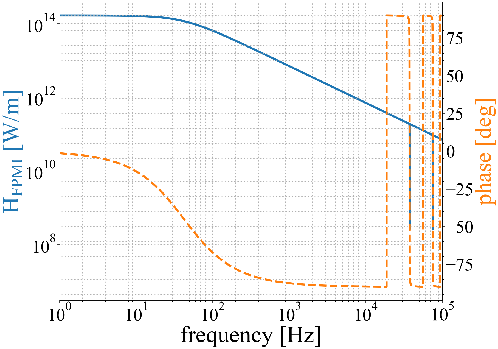
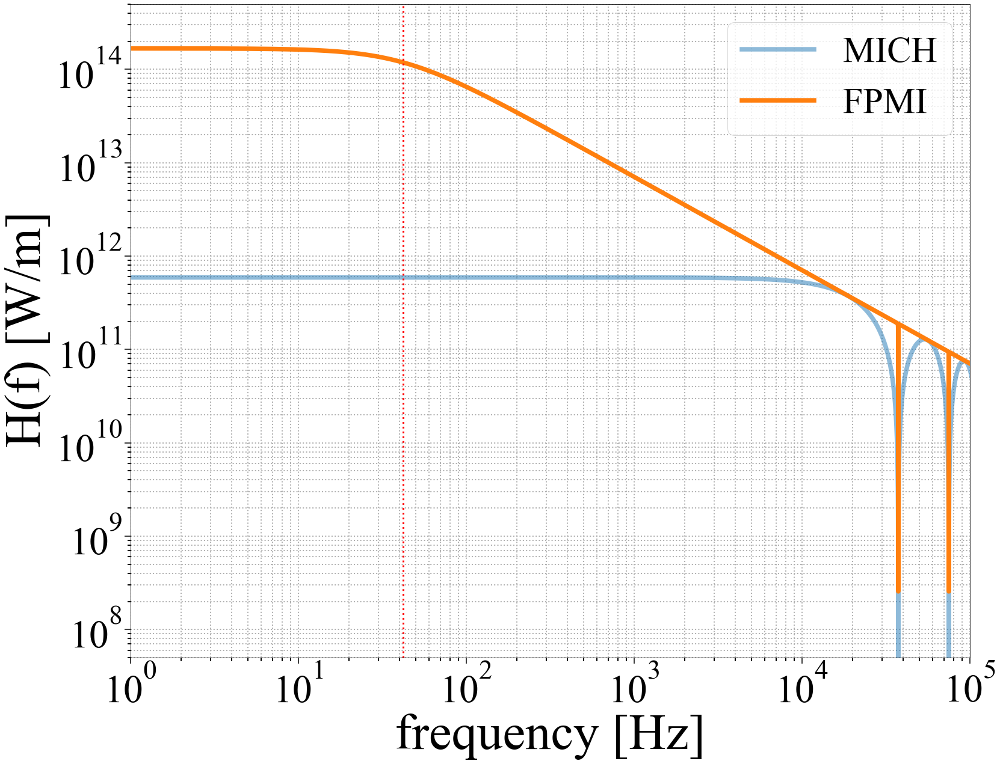
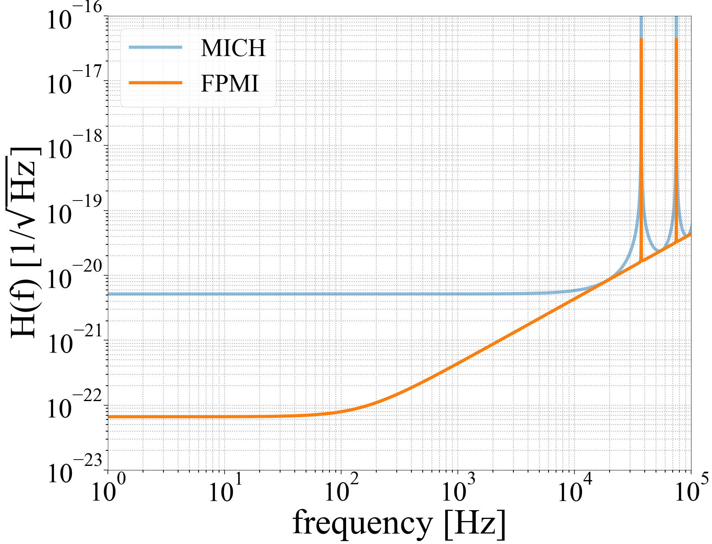

```python
import numpy as np 
import matplotlib.pyplot as plt
import scipy.signal as sig
import os
import sys
sys.path.insert(0,'../')
plt_style_dir = '../../stash/'
fig_exp_dir = '../../../figs/'
from ifo_configs import mich_freq_resp as MICH
from ifo_configs import fpmi_freq_resp as FPMI
from ifo_configs import N_shot, bode_amp, bode_ph
if os.path.isdir(plt_style_dir) == True:
    plt.style.use(plt_style_dir + 'ppt2latexsubfig.mplstyle')
plt.rcParams["font.family"] = "Times New Roman"
line_width=7.5
```
I often find it helpful to revisit that which we will need to build upon before moving forward, especially if one has not done this derivation more than a couple of times. Sooooo... 

## Last time when working with IFO configs:

**Michelson frequency response to gravitational wave**

The Michelson interferometer by it's design is a measurement device that can detect small changes in light phase between it's two perpendicular arms.

A gravitational wave offers a unique phase differential that can be characterized mathematically by the following:

$$
\phi_X - \phi_Y = \int_{t-2L/c}^{t} \Omega \bigg[1 + \frac{1}{2}h(t)\bigg]dt - \int_{t-2L/c}^{t} \Omega \bigg[1 - \frac{1}{2}h(t)\bigg]dt
$$

This eventually led us to the time independent phase response to a monochromatic gravitational wave ($h(t)$): 


$$
\Delta \phi (\omega) = h_0\frac{2 L \Omega}{c}e^{-i L \omega / c} \frac{\mathrm{sin}(L \omega /c)}{L \omega /c}
$$

Now, we are going to look at how Fabry Perót cavitites can help our Michelson become a gravitational wave observatory# Derivation

Let's start with the simple Fabry Perót cavity. The following are equations that characterize the circulating and reflected fields (both critical to measuring the phase response of the FP cavity to GWs): 

$$
E(t) = t_1 E_{in} + r_1 r_2 E(t - 2T) e^{-i \Delta \phi(t)} 
$$

$$
E_r(t) = -r_1 E_{in} + t_1 r_2 E(t - 2T) e^{-i \Delta \phi(t)}
$$

$T = L/c$ is the time it takes light to reach the end of the cavity and $\Delta \phi(t)$ is the phase rotation. 

We can define the static phase rotation (no GW passing through) as : 
$$\Delta \phi = 2kL = 4 \pi L /\lambda_{opt}  $$ 

And if L is tuned just right $2kL = 2 \pi n$ so the cavity is just tuned for resonance

If we put a gravitational wave in the mix we redefine this phase rotation as such that: 
$$\Delta \phi =  \frac{\omega_0}{2} \int_{t-\frac{2L}{c}}^{t} h(t')dt' $$ 

This assumes that the static phase rotation satisfies $2\omega_0L/c = 2 \pi n$. Which is the same thing that we said above but with different symbols (because we're fancy ;D ) 

Say that we have something that does throw the cavity slightly off resonance.. doesn't have to be a gravitational wave... but that's what we hope for. ANYWAY...

If the $\Delta \phi$ becomes such that the cavity is thrown off resonance we get a time dependent intra-cavity field: 

$$ E(t) = \bar{E} + \delta E(t) $$

and if the phase rotation ($\Delta \phi$) is super small... which is pretty much guaranteed with gravy waves, we can say: 

$$ e^{i\Delta \phi} = 1- i \Delta \phi $$

Using equations \ref{eq7} and \ref{eq8} in \ref{eq3} we get:

$$ \bar{E} + \delta E(t) = t_1 E_{in} -r_1r_2\bar{E} + r_1r_2 \delta E(t-2T) - ir_1r_2\bar{E}\Delta \phi(t)) $$

We can parse this into time dependent and time independent terms: 

$$ \bar{E} = t_1 E_{in} -r_1r_2\bar{E} $$

$$ \delta E(t) = r_1r_2 \delta E(t-2T) - ir_1r_2\bar{E}\Delta \phi(t) $$

Since the time dependent phase information is encoded in \ref{eq11} we will take the laplace transform of this equation to yield: 

$$\delta E(s) = -i \frac{r_1r_2 \bar{E}}{1-r_1r_2e^{-2sT}} \Delta \phi(s)$$

**YAS!** we are now one step closer to getting a useful expression for the phase response. But again.. what does this last equation mean? That last equation is how the change in the electric field directly relates to a small perturbation in phase (which could be either a small change in laser frequency or length modulation)


Now.. we're not done yet because that last expression does not tell us the entire story yet.. we want to see how this effects the phase differential with the **reflected** electric field.

To do this.. we have to combine equations \ref{eq3} and \ref{eq4}. (an easy way to do this is to get rid of the $ r_2 E(t - 2T) e^{-i \Delta \phi(t)} $) : 

$$ E_r(t) = \frac{t_1}{r_1}E(t) - \frac{t_1^2 + r_2^2}{r_1} E_{in}$$

if the cavity is unperturbed: 

$$ \bar{E}_r = \bigg(\frac{r_2(r_1^2 + t_1^2) - r_1}{t_1} \bigg) \bar{E} $$

and if we perturb the cavity we see that the change in the intra-cavity field is directly related to the change in the reflected field: 

$$ \Delta \phi_r(s) \equiv \frac{\delta E(s)}{\bar{E}} = \frac{t_1^2r_2}{(t_1^2 + r_1^2)r_2 -r_1} \frac{\Delta \phi(s)}{1-r_1r_2e^{-2sT}}$$

This implies that there is an additional frequency dependent factor in your phase shift and this translates into your FPMI transfer function as: 

$$ H_{FPMI}(\omega_g) = \frac{2 \Delta \phi_r(\omega_g)}{h(\omega_g)} =  \frac{t_1^2r_2}{(t_1^2 + r_1^2)r_2 -r_1} \frac{H_{\mathrm{MI}}(\omega_g, L)}{1-r_1r_2e^{-2i \omega_g L /c }}  $$

Whew.... that was a lot.... now let's code it up
Since we can seperate the calculation into two.. I'm going to parse out the calculation between the constant Fabry Perót term and the term with the frequency dependence. But first, lets set up our parameters for our FPMI:


```python
# Some parameters
cee = np.float64(299792458)
OMEG = np.float64(2*np.pi*cee/(1064.0*1e-9))
L = np.float64(4000.0)
nu = np.arange(1, 1000000, 1)
nat_nu = [np.float64(i*2*np.pi) for i in nu]
h_0 = np.float64(1)

PHI_0 = np.pi/2 #[rad]
P_IN = 25

T_1 = .014
#T_1 = 25e-6 
T_2 = 50e-6
R_1 = 1-T_1
R_2 = 1-T_2

t_1 = T_1**.5
r_1 = R_1**.5
r_2 = R_2**.5
```
Now we can compute:
$$ H_{FPMI}(\omega_g) =  \frac{t_1^2r_2}{(t_1^2 + r_1^2)r_2 -r_1}\cdot \frac{H_{\mathrm{MI}}(\omega_g, L)}{1-r_1r_2e^{-2i \omega_g L /c }}  $$

```python
H_FPMI = FPMI(nu, r_1, t_1, r_2, L, PHI_0, P_IN, OMEG)
```
We estimate the FP's pole frequency
$$  1 - r_1 r_2 e^{-2i \omega_g L / c} = 0 $$
therefore when:
$$ e^{-i \omega_g L / c} = \frac{1}{\sqrt{r_1 r_2}} $$
we acquire the pole frequency $\omega_\mathrm{pole}$ as indicated in the low pass
$$ f_\mathrm{pole} = \frac{1}{4\pi \tau_{s}} =  \frac{c}{4 \pi L} \frac{1- r_1 r_2}{\sqrt{r_1 r_2}} = \frac{\nu_\mathrm{FSR}}{2 \pi} \frac{1- r_1 r_2}{\sqrt{r_1 r_2}} = \frac{\nu_\mathrm{FSR}}{\mathcal{F}} $$

ALso, understanding that the cavity Finesse can be defined as 

$$ \mathcal{F} = \frac{\pi \sqrt{r_i r_e}}{1- r_i r_e} $$

we also can invert for a high value of finesse $ \mathcal{F} >> \pi $:

$$ r_i r_e \approx 1 - \frac{\pi}{\mathcal{F}} $$

```python
f_pole = 1/(((4*np.pi*L)*np.sqrt(r_1*r_2))/(cee*(1-r_1*r_2)))
def fpmi_lp(freq, cav_pole):
    return 1/(1 + 1j*(freq/cav_pole))#*np.exp(1j*freq/cav_pole))
H_FPMI_LP = fpmi_lp(nu, f_pole)
```
Might as well compare it to our Michelson response: 
$$ H_{\mathrm{MI}}(\omega_g) = \frac{2 L \Omega}{c}e^{-i L \omega / c} \frac{\mathrm{sin}(L \omega /c)}{L \omega /c} $$

```python
H_MICH = MICH(nu, L, PHI_0, P_IN, OMEG)
```


```python
fig, ax1 = plt.subplots()
ax1.set_xlabel('frequency [Hz]')
ax1.set_ylabel('H$_\mathdefault{FPMI} \; \mathdefault{ [W / m] } $ ', color='C0')
#ax1.plot(w/(FSR), F_w_cc_modsq*100)
ax1.loglog(bode_amp(H_FPMI), label='FPMI', linewidth=line_width,color='C0')
#ax1.loglog(w,H_MI_modsq, label= 'MICH', linewidth= 5)
#ax1.loglog(w,H_FPMI_LP_modsq*H_FPMI_modsq[0], label='FPMI LP', linewidth = 20.0, alpha=0.25,color='C2')
#ax1.axvline (x=f_pole,ymin=1e-13, color='red', linestyle='dotted', linewidth=3)
ax2 = ax1.twinx()
ax2.semilogx(nu,bode_ph(H_FPMI),'--', linewidth=line_width, color='C1')
#ax2.semilogx(w,(180/np.pi)*np.arctan(np.imag(H_MI)/np.real(H_MI)), '--')
#ax2.semilogx(w,(180/np.pi)*np.arctan(np.imag(H_FPMI_LP)/np.real(H_FPMI_LP)),linestyle='--', linewidth=20.0,dashes=(4,10),alpha=.25, color='C2')
plt.xlim([1,1e5])
plt.ylabel('phase [deg]', color='C1')
#fig.savefig('../figs/INTRO/fpmi_fr.pdf', dpi=300, bbox_inches='tight')
```


    Text(0, 0.5, 'phase [deg]')


    

    


```python
plt.loglog(nu,bode_amp(H_MICH), label= 'MICH', linewidth= line_width, alpha=.5)
plt.loglog(nu,bode_amp(H_FPMI), label='FPMI', linewidth=line_width)
#plt.loglog(nu,bode_amp(H_FPMI_LP)*bode_amp(H_FPMI)[0], label='FPMI LP', linewidth = 20.0, alpha=0.25)
plt.axvline (x=f_pole,ymin=1e-11, color='red', linestyle='dotted', linewidth=3.0)
plt.ylim([5e7, 5e14])
plt.xlim([1e0, 1e5])
#plt.grid(visible=True, which='minor', axis='y')
plt.xlabel('frequency [Hz]')
plt.ylabel('H(f) $\mathdefault{[W/m]}$')
lgd=plt.legend()
plt.savefig('../figs/INTRO/fpmi_fr.pdf', dpi=300, bbox_inches='tight')
```


    

    

You can clearly see that there is a clear increase in gain at lower frequencies (below 5000 kHz)
Doesn't exactly look like Kiwamu's but close enough?

```python
plt.semilogx(nu,bode_ph(H_MICH), '--', label='MICH', linewidth= line_width, alpha=.5)
plt.semilogx(nu,bode_ph(H_FPMI),'--', label='FPMI', linewidth= line_width)
#plt.semilogx(nu,bode_ph(H_FPMI_LP),linestyle='--', linewidth=3.0,dashes=(3,10))
plt.xlim([1,100000])
plt.ylabel('phase [deg]')
plt.xlabel('Frequency [Hz]' )
lgd=plt.legend()
```


    

    


```python
Sh_noise = N_shot(OMEG, P_IN)
```


```python
plt.loglog(nu,Sh_noise/bode_amp(H_MICH), label= 'MICH', linewidth= line_width, alpha=.5)
plt.loglog(nu,Sh_noise/bode_amp(H_FPMI), label='FPMI', linewidth=line_width)
#plt.loglog(nu,Sh_noise/(bode_amp(H_FPMI_LP)*bode_amp(H_FPMI)[0]), label='FPMI LP', linewidth = 20.0, alpha=0.25)
#plt.axvline (x=f_pole,ymin=1e-11, color='red', linestyle='dotted', linewidth=3)
plt.ylim([1e-23, 1e-16])
plt.xlim([1e0, 1e5])
plt.xlabel('frequency [Hz]')
plt.ylabel('H(f) $\mathdefault{[1/\sqrt{\mathdefault{Hz}}]}$')
lgd=plt.legend()
fig.savefig('../figs/INTRO/fpmi_sensi.pdf', dpi=300, bbox_inches='tight')
```

    /Users/daniel_vander-hyde/anaconda3/envs/jupy/lib/python3.7/site-packages/IPython/core/pylabtools.py:151: UserWarning: Creating legend with loc="best" can be slow with large amounts of data.
      fig.canvas.print_figure(bytes_io, **kw)


    

    

### *Heavily HEAVILY inspired by Kiwamu's thesis chapter on this subject (https://gwic.ligo.org/thesisprize/2012/izumi-thesis.pdf)